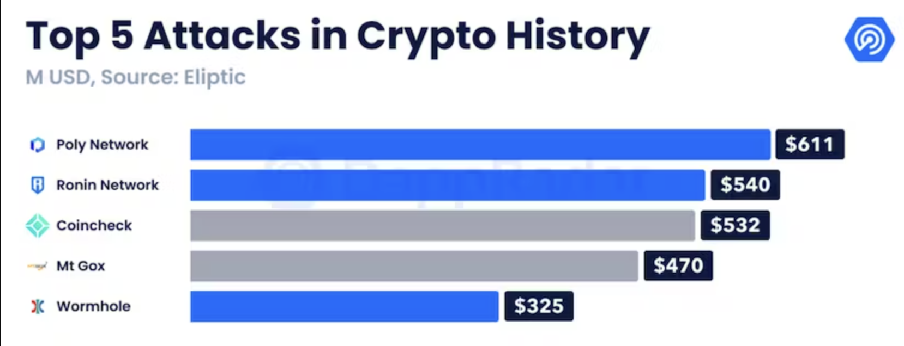
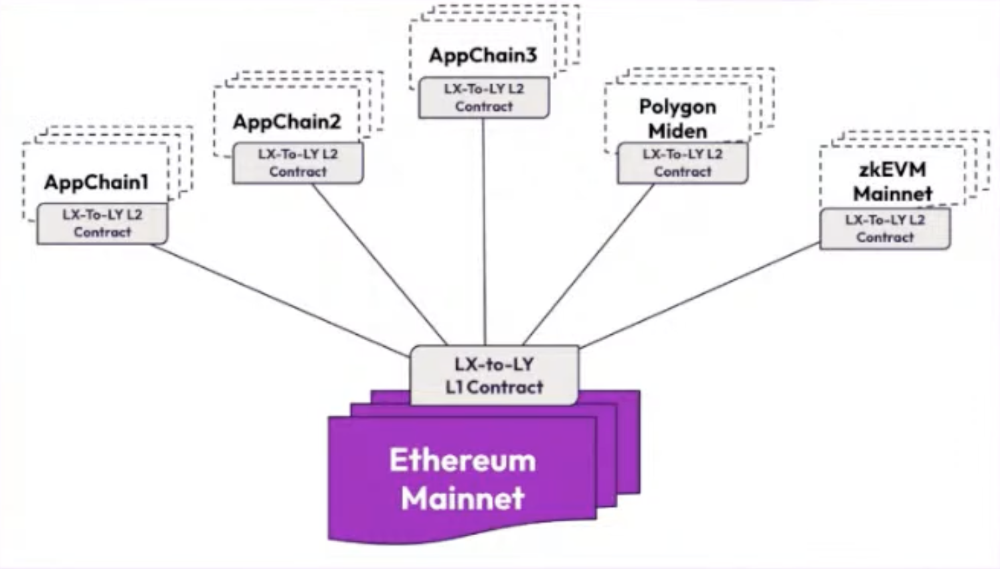
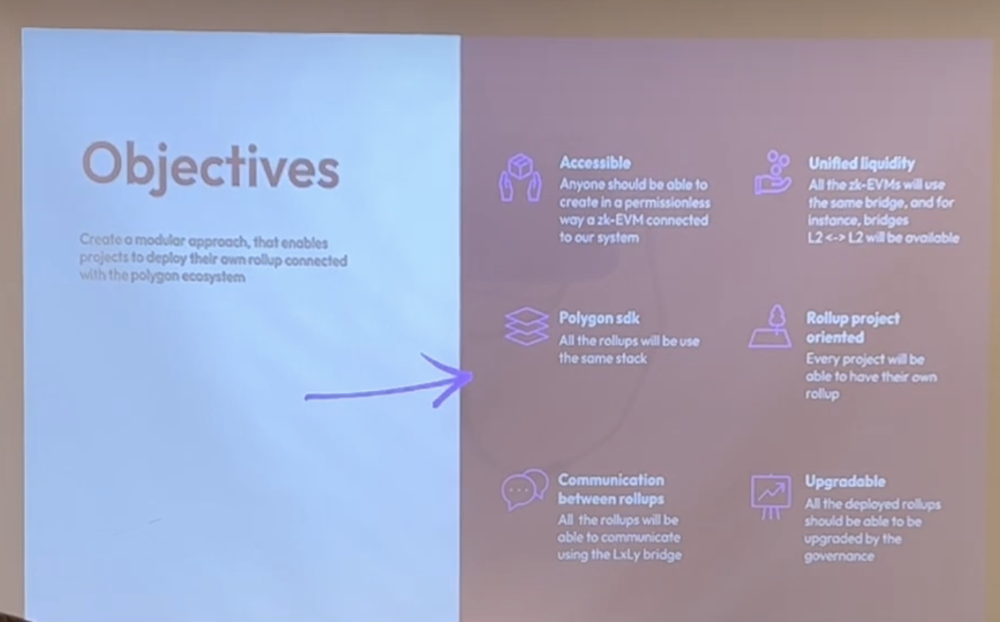
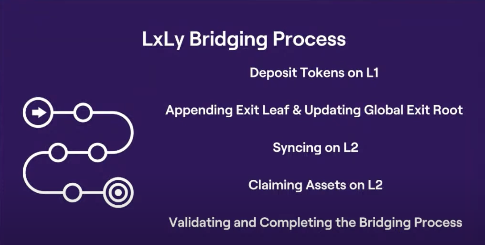
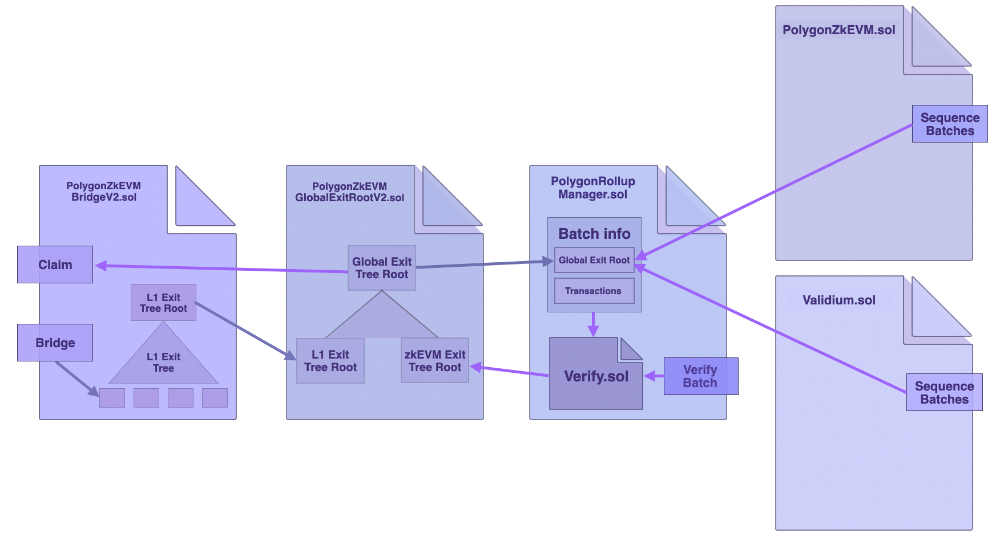

# Polygon LxLy

## Quickstart

This repo contains 2 scripts as an example for how how to send and claim messages on the Polygon LxLy Bridge.

These 2 scripts contain just the core functionality highlighting the key sending and claiming functionality.

To get the full contracts and code snippets, see [PingPongExample](https://github.com/0xPolygonHermez/code-examples/tree/main/pingPongExample).

## Quickstart

The followign snippet must be run in conjuction with the `PingPongExample`.

`npx hardhat run send.js --network goerli`

`npx hardhat run claim.js --network goerli`

# What is the Polygon LXLY and Why Is it So Useful?

Bridges are an important piece of the blockchain ecosystem. Allowing developers to build app-chains customized to their specific needs, while giving users the flexibility to move between different chains. In this article we’ll cover what are bridges and the two types of bridges. Finally we’ll cover the LxLy bridge, the benefits of the bridge, how it works and run through a live coding example.

## A brief introduction to bridges

When the idea of a blockchain first gained prominence it was the potential of a universal database of assets that anyone can read or write into. Along the way, different blockchains started to prop up each offering different value propositions. From a user’s side people don’t want to keep track of different chains and from a developer side, they want to mantain sovereignty and flexibility on the chain that works best for them. Which is why bridges are so useful.

It allow both builders and end-users to each get what they want. Developers can build an app-specific chain that is customized to exactly what they want. While users can use an app on a chain without being worried about all their assets being locked into a specific chain.

## Trusted vs Trustless Bridges

Bridges are extremely valuable to the blockchain ecosystem and near the peak in March 2022, over $200 billion worth of assets were locked in bridges.

There are two types of bridges that allow users to implement a cross-chain strategy. Trusted and trustless Bridges.

With trusted Bridges, a third party validates transactions and acts as a custodian of the bridged assets. While in a trustless bridge smart contracts are the primary custodians of the assets.

| Trusted Bridge | Trustless Bridges |
| --- | --- |
| Depends on central entity to custody assets | Operate using smart contracts and algorithms |
| Users must rely on bridge operator’s reputation. Trust assumptions on funding custody and bridge security | Security of the bridge is the same as the underlying blockchain.
Trust assumptions based on smart contract code |
| Users give up control of their crypto assets | Users remain in control of their assets |

Due to the combination of a large amount of assets being stored in blockchain bridges combined with the centralized nature of how assets are stored. [Most of the biggest hacks in the blockchain space have been on bridges](https://thedefiant.io/hackers-target-blockchain-bridges), specifically trusted bridges.

The challenge with bridges is that they re-introduce the exact same problems that the blockchain was intended to solve. With trustless bridges such as the Ronin bridge, the security is dependent on the custodian so bridges like the Ronin bridge that used a multi-chain architecture, got exploited when 4 out of the 5 signers were hacked. 

With trustless bridges, if there is a bug in the smart contract the bridge can also get hacked, which is what caused the Wormhole attack.

## Polygon LxLy Bridge

## Benefits

There are [6 main objectives](https://youtu.be/BOk2y_AtaYw?si=9VFMMwdamjMkwgjj&t=133) of the  Polygon Lx-Ly bridge.

1. Accessibility: Anyone can permissionlessly create a zk-EVM connected to the system
2. Unified Liquidity: All the Zk-EVMs will use the same bridge and L2 to L2 bridges will be available
3. POlygon SDK: Bridges will use the same stack
4. Roll-up centric: Every project can create their own rollup
5. Communication between Rolups: All rollups can communicate using the LXLy bridge
6. Upgradeable: All the deployed rollups will be upgraded by the governance

In the future, [Polygon intends to allow App chains being able to talk with each other directly](https://www.youtube.com/live/MKvGl28pknE?si=G2gh6UcZccwjr8dB&t=603) without having to use the L1 as an intermediary.

### Interoperability

Another [unique feature](https://wiki.polygon.technology/docs/zkevm/protocol/lxly-bridge/#what-remains-unchanged) about the Polygon LXLY bridge is that the bridging logic is separated from the Global Exit Root Logic, which is important for allowing interoperability.

## How it Works

1. Deposit tokens on L1
User initiates a transaction on Ethereum L1. Deposit tokens to `PolygonZkEVMBridge` that triggers `bridgeAsset` function in the contract

2. Append Exit Leaf & Update Global Exit Root
Bridge asset calls a `_deposit` function that calculates the leave value based on user deposit details.

3. Syncing on L2
After some time, global exit root is updated on L2. Sequencer fetches Global Exit Root, which is in the designated storage slots of `PolygonkEVMGlobalExitRootL2`. Guarantees that the global exit root is stored at a particular location

4. Claiming Assets on L2
User constructs a Merkle proof of their deposit leaf on L2 and submit a transaction on L2 to call `claimAsset` on `PolygonZkEVMBridge`

5. Validate and Complete the Bridging process
 Inside `claimAsset` function of `PolygonZkEVMBridge` contract verifies the provided Merkle proof.

## Conclusion

In conclusion, bridges play an important role in the blockchain ecosystem, providing developers with the flexibility to construct application-specific blockchains and enabling users to seamlessly navigate between different chains. 

For further reading, see the following resources

- Cross-Chain Hacks with LxLy Bridge | Polygon DevX Americas Workshop Series Ep04: [https://www.youtube.com/watch?v=MKvGl28pknE](https://www.youtube.com/watch?v=MKvGl28pknE)
- Designing the Polygon zkEVM LxLy Bridge, by Jesus Ligero: [https://www.youtube.com/watch?v=BOk2y_AtaYw](https://www.youtube.com/watch?v=BOk2y_AtaYw)
- LXLY Bridge: Polygon Wiki: [https://wiki.polygon.technology/docs/zkevm/protocol/lxly-bridge](https://wiki.polygon.technology/docs/zkevm/protocol/lxly-bridge)
